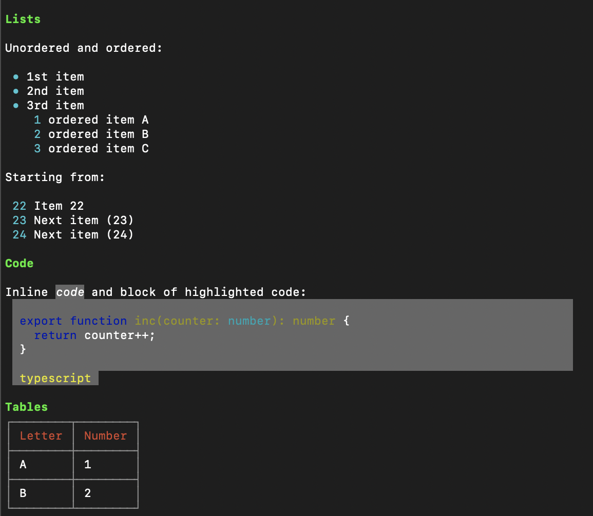

# marked-terminal-renderer


Modern, full featured terminal renderer extension for
[marked](https://github.com/markedjs/marked).

Use it as an extension or use the built in `catmd` CLI tool to render Markdown
files directly in your terminal. See the [usage section](#usage) for more
details.

Most Markdown syntax is supported and rendered with supported terminal (tested
on `iTerm2`):

- Inline Elements & Typography
  - 🌼 Text wrapping and alignment
  - 🌼 Headings (H1 to H6)
  - 🌼 Bold, Italic, Strikethrough
  - 🌼 Clickable Links
  - 🌼 Emojis
  - 🌼 Inline code highlighted
- Block elements
  - 🌼 Horizontal rules
  - 🌼 Lists (ordered, unordered, nested, task lists)
  - 🌼 Blockquotes with nesting
  - 🌼 Code blocks with syntax highlighting
  - 🌼 Tables
- Images
  - 🌼 Local and remote (HTTP/S) images rendered directly in terminal
- Colorful themes
  - 🌼 Light and Dark themes included, easily customizable

## Example output rendered in `iTerm2`



### Usage

#### Installation

Local installation for using it an extension with `marked`:

```shell
npm i marked-terminal-renderer
```

Or use globally to get access to the `catmd` CLI tool:

```shell
npm i -g marked-terminal-renderer
```

#### Usage with marked as an extension

Basic usage example, note the use of `await` since the renderer is asynchronous:

```javascript
import { marked } from "marked";
import { createTerminalRenderer, darkTheme } from "marked-terminal-renderer";

marked.use(createTerminalRenderer(darkTheme()));
console.log(
  await marked.parse(
    "# Hello World\nThis is **bold text** and this is a [link](https://example.com). :smile:",
  ),
);
```

#### Usage with the `catmd` CLI tool

After installing globally, you can use the `catmd` command to render Markdown
files directly in your terminal:

```shell
catmd README.md

catmd -t light README.md
```

### TODOs

- [ ] complete documentation
- [ ] should support different highlight based on themes (dark/light)
- [ ] support auto numbered nested lists (1., 1.1., 1.1.1., etc)
- [x] fix any wrapping issues with nested elements (like lists inside
      blockquotes)

### 3rd Party Libraries

Shout out to the following libraries that make this renderer possible ❤️:

| Feature | Library                                                          |
| ------- | ---------------------------------------------------------------- |
| Tables  | [cli-table3](https://github.com/cli-table/cli-table3)            |
| Colors  | [chalk](https://github.com/chalk/chalk)                          |
| Images  | [terminal-image](https://github.com/sindresorhus/terminal-image) |
| Links   | [terminal-link](https://github.com/sindresorhus/terminal-link)   |
| Emojis  | [node-emoji](https://github.com/omnidan/node-emoji)              |
